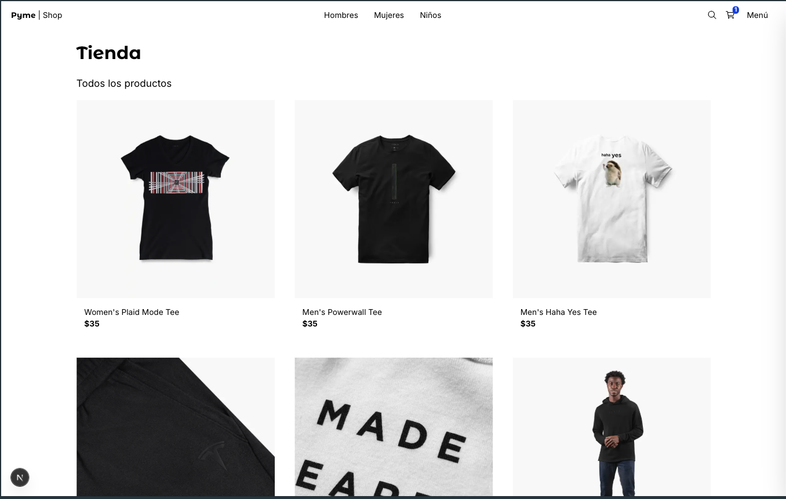
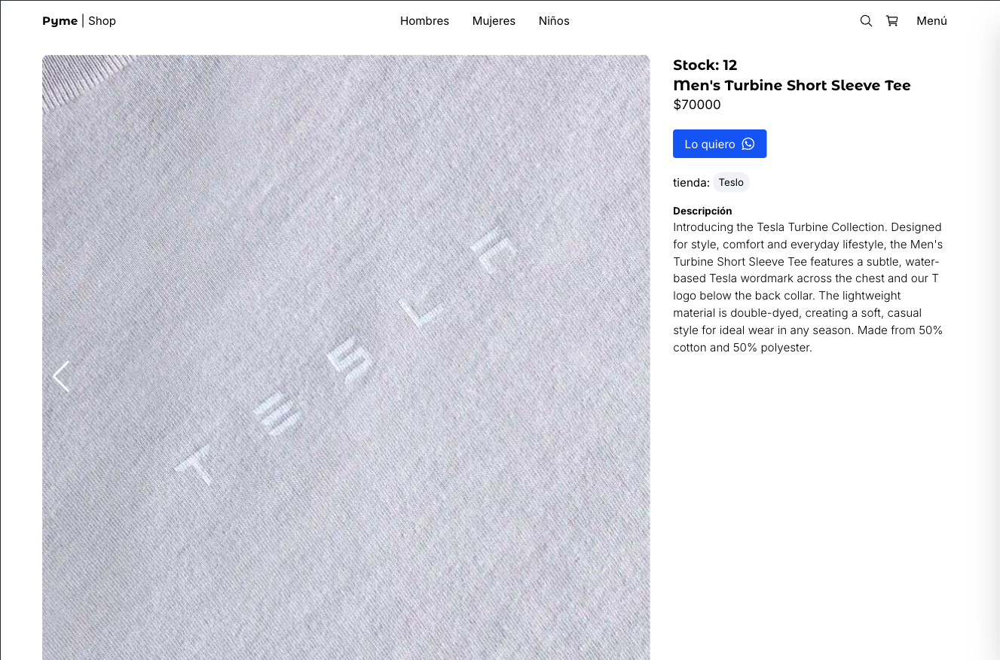

# Hi, I'm Andres Vega 👨🏻‍💻 


## **Software Engineer | FullStack Developer**

Links | About
---- | ----
[LINKEDIN](https://www.linkedin.com/in/andres-vega-89a0558a/) | 👨🏻‍💻 My professional profile
[BLOG](https://able-addition-7e9.notion.site/Otro-blog-de-un-dev-8c354321dc5682539d79813d355cde9b) | 📝 My personal blog
[HACKERANK](https://www.hackerrank.com/elb_andres8) | 📑 Show some of a logic skills
[UDEMY](https://www.udemy.com/user/88efbec4-3461-4970-ae43-a3d8485ed240/) | 📹 My favorites course collection 🤓


## What about me?

In my 10 years of experience as a developer, I have accumulated great knowledge in **Frontend**, **Backend**, **Databases** and **hybrid application development**, implementing **Design Patterns and Architectures** for improve my productivity and eficiently. I have collaborated in different platforms in sectors such as _Education_, _Fintech_, _Social Security_, _Public Services_ among others. I like to read about technology to always have the best tools with which to develop my work every day, watch videos for keep updated and take several points of view.

I am currently reinforcing all the knowledge about **IA**, as implementing **Harness Engineering**, for develop and environment to agents working with SDD or TDD to be exponentially performant.

### My professional experience

[Download My CV](./assets/FullStackDeveloper_Andres_Vega_2026.pdf "download") 👈


## Hobbies

```js
const myHobbieList = [
  'Video Games 🎮',
  'Play Futbol ⚽️',
  'Read about Technology 📖',
  'watch TV shows and youtube videos 📺',
  'Type code 🧑‍💻',
],
```

## Skills

[](https://github.com/stats-organization/github-stats-extended)

| Tecnology | Stars | Frameworks/Libraries |
|-------|---------|------|
|`Javascript/Typescript` | ⭐️⭐️⭐️⭐️⭐️ | `Angular, React(ReactJS, React Native, NextJS), NestJS, Express` |
|`Python` | ⭐️⭐️⭐️ | `Django, FastAPI` |
|`PHP` | ⭐️⭐️⭐️ | `Laravel, Symfony` |
|`Dart` | ⭐️⭐️⭐️ | `Flutter` |
|`Java` | ⭐️⭐️⭐️ | `Spring Boot` |
|`Databases` | ⭐️⭐️⭐️⭐️ | `Postgres, MySQL, MongoDB, Redis, SQLite` |
|`Cloud` | ⭐️⭐️⭐️ | `AWS, Firebase, Vercel, Supabase` |
|`Environment` | ⭐️⭐️⭐️⭐️⭐️ | `Git, Docker, Unit Testing, RabbitMQ` |
|`Architecture` | ⭐️⭐️⭐️⭐️ | `GraphQL, REST, Hexagonal Arch, Microservices, Modular Monolitics, OWASP, DDD` |
|`IA` | ⭐️⭐️⭐️⭐️ | `Opencode, Harness Engineering, SDD` |

## Working on

### [PymeShop](https://pyme-shop-web.vercel.app/landing) **version: 1.1.0** (2026-06-30)

[https://pyme-shop-web.vercel.app](https://pyme-shop-web.vercel.app)

This store was created with Nextjs and Postgres (prisma). Was develop using IA SDD harness for apply agentic colaboration. The goal for this project is practice about new Nextjs features and implement payments and others features too.

About the store, you can create a single tenant and public you own products.

**Soon:**

* Would be able for add online payments, and suscriptions. For now the store is free without a specific limit.
* Add a description for architecture on full detail

code: https://github.com/eandres8/pyme-shop-web

<p align="center">
  
  
</p>


<!--
**eandres8/eandres8** is a ✨ _special_ ✨ repository because its `README.md` (this file) appears on your GitHub profile.

Here are some ideas to get you started:

- 🌱 I’m currently learning ...
- 👯 I’m looking to collaborate on ...
- 🤔 I’m looking for help with ...
- 💬 Ask me about ...
- 📫 How to reach me: ...
- 😄 Pronouns: ...
- ⚡ Fun fact: ...
-->
