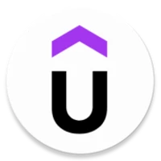

## Hi, I'm Andres Vega 👨🏻‍💻
**FullStack Developer**

    

        <ul style="display: flex; margin: 0; padding: 0 0 0 15px">
            <li style="width: 10px"></li>
            <li style="width: 10px"></li>
            <li style="width: 10px"></li>
        </ul>
    

    <fieldset style="padding: 5px 15px; margin: 10px; border-radius: 15px; border: 2px solid #08aa90;">
        <legend>< header ></legend>
        

            
        

    </fieldset>
    

        <fieldset style="padding: 5px 15px; margin: 10px; border-radius: 15px;border: 2px solid #ffc107;">
            <legend>< aside ></legend>
            

                Hobbies
            

            <ul>
                <li>Video Games 🎮</li>
                <li>Play Futbol ⚽️</li>
                <li>Read about Technology 📖</li>
                <li>watch TV shows 📺</li>
            </ul>
        </fieldset>
        <fieldset style="padding: 5px 15px; margin: 10px; border-radius: 15px; border: 2px solid #ffc107;">
            <legend>< article ></legend>
            

                En mis 7 años de experiencia como desarrollador, he acumulado gran conocimiento en <strong>Frontend</strong>, <strong>Backend</strong>, <strong>Bases de datos</strong> y desarrollo de <strong>aplicaciones híbridas</strong>. He colaborado en distintas plataformas en sectores como <em>educación</em>, <em>Fintech</em>, <em>Seguridad social</em> entre otras. Me gusta leer sobre tecnología para siempre tener las mejores herramientas con las cuales desarrollar mi trabajo cada día.
            

            

                Me encuentro actualmente reforzando todo el conocimento que puedo obtener de <strong>Patrones de diseño y de arquitectura</strong>. Sin embargo quiero estudiar temas que me apasionan como <strong>seguridad informatica</strong> y algo de <strong>desarrollo de video juegos</strong>.
            

        </fieldset>
    

    <fieldset style="padding: 5px 15px; margin: 10px; border-radius: 15px">
        <legend>< script ></legend>
        

            <pre>
                <code>
                    const skills = {
                        languages: [ Javascript, Typescript, PHP, Python, Dart ],
                        frameworks: [ Angular, Flutter, Laravel, AdonisJS, NestJS, React Native, React, Ionic, Express],
                        dataBases: [MySQL, PostgreSQL, MongoDB],
                        environment: [Git, Github, Bitbucket, Docker, Unit Testing],
                        learning: [GraphQL, AWS, English]
                    }
                </code>
            <pre>
        

    </fieldset>
    <fieldset style="padding: 5px 15px; margin: 10px; border-radius: 15px; border: 2px solid #0dcaf0;">
        <legend>< footer ></legend>
        <ul style="display: flex; list-style: none; justify-content: center;align-items: center">
            <li style="margin-right: 10px">Contact:</li>
            <li style="margin-right: 10px; width: 20px">
                
            </li>
            <li style="margin-right: 10px; width: 25px">
                
            </li>
            <li style="margin-right: 10px; width: 25px">
                
            </li>
        </ul>
    </fieldset>

<!--
**eandres8/eandres8** is a ✨ _special_ ✨ repository because its `README.md` (this file) appears on your GitHub profile.

Here are some ideas to get you started:

- 🔭 I’m currently working on ...
- 🌱 I’m currently learning ...
- 👯 I’m looking to collaborate on ...
- 🤔 I’m looking for help with ...
- 💬 Ask me about ...
- 📫 How to reach me: ...
- 😄 Pronouns: ...
- ⚡ Fun fact: ...
-->
